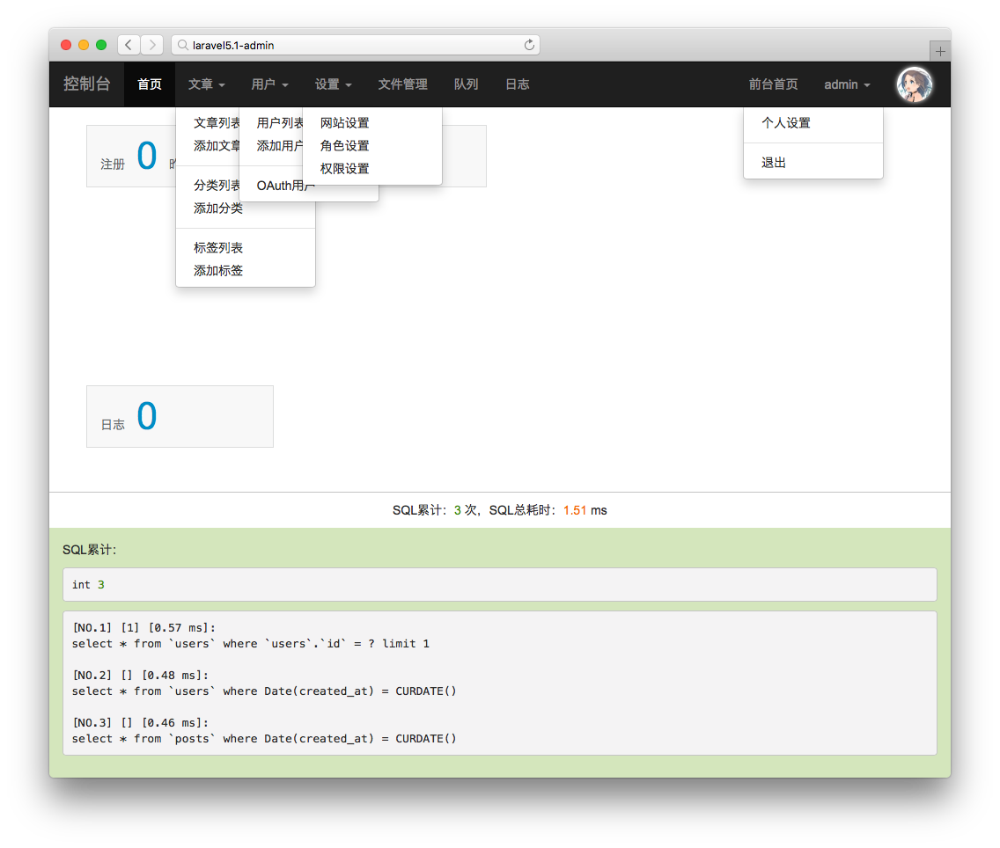

# laravel5.1-admin

## 安装

### 克隆

`git clone https://github.com/phphp/laravel5.1-admin.git`

### 配置

1. 安装组件：`composer install`
* 复制 .env 文件：`cp .env.example .env`
* 生成 APP_KEY：`php artisan key:generate`
* 配置 .env 文件中的数据库（用到邮件和 github OAuth 功能则需要填写相应的项目）

### 迁移和填充数据库

1. `php artisan migrate`
* `php artisan db:seed`

## 权限

* `public/uploads`
* `storage`
* `bootstrap/cache`

以上这些目录包括其子目录都需要有写权限。

`config` 目录其下文件可在后台修改，但默认文件没有写权限，需要手动修改权限。

`public` 目录默认没有写权限，其子目录 uploads 有。

## 登录

登录地址：/admin/login。

默认账户密码为：admin secret。

## 相关文档

1. [上传文件](docs/上传文件.md)
* [使用社会化登录](docs/使用社会化登录.md)